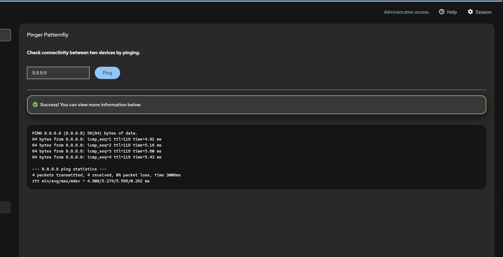

# Cockpit Pinger Patternfly

A recreation of the cockpit pinger plugin used for tutorial at https://cockpit-project.org/blog/creating-plugins-for-the-cockpit-user-interface.html

Made for learning about making plugins for Cockpit.

But using the [Patternfly](https://www.patternfly.org/) UI library instead, so it looks well integrated into Cockpit's User interface.



# Features
- Follows Cockpit interface's design language
- Uses TypeScript for type-safety & easier development
- Can choose the host to ping
- Shows additional alert depending on the result of ping
- Displays command output below the alert

# Development dependencies

On Debian/Ubuntu:

    sudo apt install gettext nodejs npm make

On Fedora:

    sudo dnf install gettext nodejs npm make

On openSUSE Tumbleweed and Leap:

    sudo zypper in gettext-runtime nodejs npm make

# Getting and building the source

These commands check out the source and build it into the `dist/` directory:

```
git clone https://github.com/yashjawale/cockpit-pinger-patternfly.git
cd cockpit-pinger-patternfly
make
```

# Installing

`make install` compiles and installs the package in `/usr/local/share/cockpit/`. The
convenience targets `srpm` and `rpm` build the source and binary rpms,
respectively. Both of these make use of the `dist` target, which is used
to generate the distribution tarball. In `production` mode, source files are
automatically minified and compressed. Set `NODE_ENV=production` if you want to
duplicate this behavior.

For development, you usually want to run your module straight out of the git
tree. To do that, run `make devel-install`, which links your checkout to the
location were cockpit-bridge looks for packages. If you prefer to do
this manually:

```
mkdir -p ~/.local/share/cockpit
ln -s `pwd`/dist ~/.local/share/cockpit/cockpit-pinger-patternfly
```

After changing the code and running `make` again, reload the Cockpit page in
your browser.

You can also use
[watch mode](https://esbuild.github.io/api/#watch) to
automatically update the bundle on every code change with

    ./build.js -w

or

    make watch

When developing against a virtual machine, watch mode can also automatically upload
the code changes by setting the `RSYNC` environment variable to
the remote hostname.

    RSYNC=c make watch

When developing against a remote host as a normal user, `RSYNC_DEVEL` can be
set to upload code changes to `~/.local/share/cockpit/` instead of
`/usr/local`.

    RSYNC_DEVEL=example.com make watch

To "uninstall" the locally installed version, run `make devel-uninstall`, or
remove manually the symlink:

    rm ~/.local/share/cockpit/cockpit-pinger-patternfly

# Running eslint

Cockpit Starter Kit uses [ESLint](https://eslint.org/) to automatically check
JavaScript/TypeScript code style in `.js[x]` and `.ts[x]` files.

eslint is executed as part of `test/static-code`, aka. `make codecheck`.

For developer convenience, the ESLint can be started explicitly by:

    npm run eslint

Violations of some rules can be fixed automatically by:

    npm run eslint:fix

Rules configuration can be found in the `.eslintrc.json` file.

## Running stylelint

Cockpit uses [Stylelint](https://stylelint.io/) to automatically check CSS code
style in `.css` and `scss` files.

styleint is executed as part of `test/static-code`, aka. `make codecheck`.

For developer convenience, the Stylelint can be started explicitly by:

    npm run stylelint

Violations of some rules can be fixed automatically by:

    npm run stylelint:fix

Rules configuration can be found in the `.stylelintrc.json` file.

# Thanks to
- Starter Kit project at https://github.com/cockpit-project/starter-kit/
- Original pinger tutorial at https://cockpit-project.org/blog/creating-plugins-for-the-cockpit-user-interface.html

---

<a href="https://yashjawale.github.io/" target="_blank"></a>